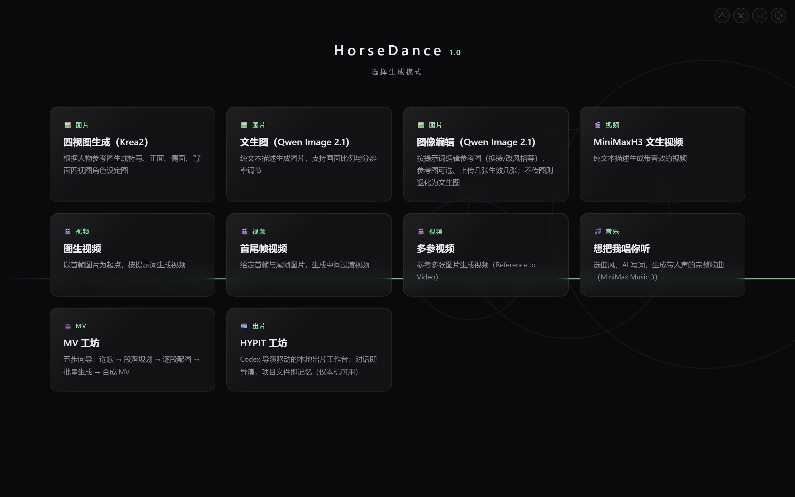

# ComfyUI Webapp

把 ComfyUI 的工作流封装成**卡片式网页界面**：不用记节点、不用拖连线，打开浏览器就能生成视频、图片和歌曲，并统一管理任务、模型与文件。

项目是一个**单文件 FastAPI 后端**（`server.py`）+ **纯静态前端**（`static/`，无构建步骤）。它不替代 ComfyUI，而是站在 ComfyUI 前面：所有生成都通过 ComfyUI 的 HTTP/WebSocket API 完成。

> 适用场景：自己（或家人/小团队）在局域网或远程使用一台 ComfyUI 机器。
> 不是 SaaS，没有多租户，**设计前提是部署者自己管好网络边界**——请先读 [安全说明](#安全说明)。

---

## ⚠️ 先读这一段：它依赖特定的 ComfyUI 节点

本项目的每个"模式"都对应 `workflows/` 里一份 API 格式工作流，而这些工作流引用了**社区自定义节点**。全新安装的 ComfyUI **无法直接跑通**任何模式——你会看到节点缺失报错。

工作流中用到的节点（按用途分组）：

| 用途 | 需要的节点来源 |
| --- | --- |
| 视频生成 | MiniMax H3 系列（`MiniMaxH3ImageToVideo`、`MiniMaxH3ReferenceToVideo`、`VAEDecodeAudio` 等） |
| 歌曲生成 | MiniMax Music 3 系列（`Music3StylePreset`、`MiniMaxMusic3LyricsWorkbench`、`Music3SaveInfo` 等） |
| 生图 / 图像编辑 | Qwen Image 2.1（`TESpeedQwenImage21`、`TextEncodeQwenImage21`、`QwenSwitchNode`） |
| 四视图设定图 | Krea2（`Krea2EditModelPatch`、`Krea2EditGroundedEncode`） |
| 提示词增强 | `TE_H3_Prompt_Enhancer`、`TE_Qwen_Image_2_1_Prompt_Enhancer`、`QwenTE_ModelLoader` 等 |
| 通用辅助 | `ResolutionSelector`、`ImageResizeKJv2`（KJNodes）、`Seed (rgthree)`（rgthree-comfy）、`ComfyMathExpression`、`PrimitiveFloat/String` |

**这意味着**：这个仓库更像是「一套可运行的工作流 + 前端外壳」的参考实现，而不是装上就能用的通用工具。如果你的节点集与 `workflows/*.json` 不一致，你可以：

1. 直接在 ComfyUI 里搭好工作流，**导出为 API 格式**（勾选 "Export (API)"），替换 `workflows/` 下对应文件；
2. 再对照 `workflows/modes.json` 修改**注入点**（告诉前端"提示词写进哪个节点、第几个输入"）。

`modes.json` 就是前端与工作流之间的契约，改这一个文件就能适配你自己的工作流。详见 [适配自己的工作流](#适配自己的工作流)。

---

## 功能

<!-- 截图占位：建议放首页 + 一个生成页 + 管理页共 3 张，宽度 900 左右 -->
<!--  -->

| 模块 | 说明 |
| --- | --- |
| **首页** | 模式卡片选择器，根据你的工作流动态生成 |
| **通用生成页** | 视频生成（文生视频 / 图生视频 / 首尾帧 / 多参参考）、Qwen 文生图与图像编辑、Krea2 四视图；含素材槽、提示词增强与改写、高级参数（步数 / 分辨率 / 模型 / LoRA 强度）、实时进度、生成历史 |
| **想把我唱你听** | MiniMax Music 3 歌曲生成：曲风预设、人声性别、AI 写词、时长 30–300s，并可做**逐字卡拉OK 对齐** |
| **MV 工坊** | 五步向导：选歌 → 段落规划 → 逐段配图 → 批量生成 → 合成下载 |
| **HYPIT 工坊** | 调用本机 `codex` CLI 做导演式对话出片（**仅回环直连可用**，见安全说明） |
| **管理员界面** | 系统状态与性能（CPU / 内存 / GPU / 显存）、**模型管理**（扫描 / 上传 / 启停 / 删除进回收站）、**文件管理**（input / output / workflow 三根的浏览、上传、下载、复制、重命名、删除） |
| **多后端"车道池"** | 同时接多台 ComfyUI（本机 + 云端），自动挑最空闲的一台排队，云端产物自动回传到本地统一预览 |
| **鉴权** | 表单登录 + 签名 Cookie；管理员另有独立账号与独立会话 |

### 多后端车道池（lanes）

一台机器跑不动、或者想临时借用云端算力时，可以在 `lanes.json` 里配多台 ComfyUI：

- **自动调度**：后台每 5 秒轮询各实例队列，`auto` 模式选队列最短的在线实例；
- **模型预设注入**：云端实例的模型文件名通常与本地不同，可用每条车道的 `models` / `params` 覆盖模板默认值；
- **输入自动重推**：提交前把素材上传到目标实例；
- **产物自动回传**：云端结果拉回本地 `output/<lane_id>/`，前端预览逻辑完全复用；
- **强制本地**：Qwen 生图、音乐、MV 等模式只在本地车道运行（`local_only`）。

修改 `lanes.json` 后需**重启进程**生效（无热重载）。

---

## 快速开始

### 1. 前置条件

- **Windows**（后端用 `ctypes.windll` 读 CPU/内存，GPU 走 `nvidia-smi`，目前仅支持 Windows）
- **Python 3.10+**（代码使用了 `X | None` 类型标注）
- **已在运行的 ComfyUI**（默认 `http://127.0.0.1:8188`），且已装好上一节列出的自定义节点与模型

### 2. 安装

```bash
git clone https://github.com/cxhzzb/comfyui-webapp.git
cd comfyui-webapp
python -m venv .venv
.venv\Scripts\activate
pip install -r requirements.txt
```

### 3. 配置

```bash
copy config.example.json config.json
```

编辑 `config.json`，至少把 `comfyui_root` 改成你的 ComfyUI 安装目录：

```jsonc
{
  "comfyui_root": "D:\\ComfyUI",                  // ComfyUI 安装根
  "comfy_shared_root": "D:\\ComfyUI-Shared",      // 共享 input/output/models 的根（可选）
  "host": "0.0.0.0",
  "port": 8800
}
```

> 没有 `config.json` 也能启动：会用通用默认值（`C:\ComfyUI`），并在控制台打印实际生效的配置。

### 4. 设置登录账号

```bash
copy auth_config.example.json auth_config.json
```

填入自己的账号密码，并把 `secret_seq`（管理员页面的隐藏解锁图案）改成自己的组合：

```jsonc
{
  "auth_user": "admin",
  "auth_pass": "你的强密码",
  "admin_user": "admin",
  "admin_pass": "你的强密码",
  "session_secret": "用 python -c \"import secrets;print(secrets.token_hex(16))\" 生成",
  "secret_seq": ["circle", "circle", "square", "x"]
}
```

如果 `auth_config.json` 不存在或字段缺失，**首次启动会自动生成随机密码并打印在控制台**，同时落盘保存。

### 5. 启动

```bash
python server.py
```

或双击 `start_webapp.bat`（端口自动读 `config.json`）。

浏览器打开 <http://127.0.0.1:8800> 登录即可。

---

## 配置项

所有配置的解析优先级：**环境变量 > `config.json` > 代码内通用默认值**。

| `config.json` 键 | 环境变量 | 默认值 | 说明 |
| --- | --- | --- | --- |
| `comfyui_root` | `COMFYUI_ROOT` | `C:\ComfyUI` | ComfyUI 安装根 |
| `comfy_shared_root` | `COMFY_SHARED` | `comfyui_root` 同级的 `ComfyUI-Shared` | 共享 `input` / `output` / `models` 的根 |
| `karaoke_python` | `WEBAPP_KARAOKE_PYTHON` | 由 `comfyui_root` 推断 | 装了 `faster-whisper` 的解释器，用于卡拉OK 对齐 |
| `hypit_root` | `WEBAPP_HYPIT_ROOT` | `~/HYPIT` | HYPIT 工坊的项目根 |
| `video_projects_root` | — | `~/Videos` | HYPIT 工坊的第二个根目录 |
| `codex_cmd` | `CODEX_CMD` | `PATH` 里的 `codex` | HYPIT 对话调用的 CLI |
| `hypit_cmd` | `HYPIT_CMD` | `PATH` 里的 `hypit` | HYPIT 参考视频下载 CLI |
| `host` | `WEBAPP_HOST` | `0.0.0.0` | 监听地址 |
| `port` | `WEBAPP_PORT` | `8800` | 监听端口 |

由以上推导出的路径（不可单独配置）：

```
models_root        = <comfyui_root>/models
shared_models_root = <comfy_shared_root>/models
input_root         = <comfy_shared_root>/input
output_root        = <comfy_shared_root>/output
workflow_dir       = <comfyui_root>/user/default/workflows
```

另外这些配置**不在 `config.json` 里**，直接用环境变量或独立文件：

| 用途 | 配置方式 |
| --- | --- |
| 线上大模型（提示词增强/写词） | `llm_api_config.json`（复制 `llm_api_config.example.json`），或 `LLM_API_BASE` / `LLM_API_KEY` / `LLM_API_MODEL` |
| 登录账号密码 | `auth_config.json`，或 `WEBAPP_AUTH_USER` / `WEBAPP_AUTH_PASS` / `WEBAPP_ADMIN_USER` / `WEBAPP_ADMIN_PASS` / `WEBAPP_SESSION_SECRET` |
| 公网 IP 监控邮件 | `mail_config.json`（复制 `mail_config.example.json`） |
| 曲风预设目录、本地 GGUF 模型 | `COMFY_HOME`（默认回落 `comfyui_root`） |
| 卡拉OK 模型大小 / 下载源 | `KARAOKE_MODEL`（默认 `small`）、`HF_ENDPOINT` |
| WebSocket 调试日志 | `WS_DEBUG=1` |

---

## 适配自己的工作流

前端与工作流之间靠 `workflows/modes.json` 解耦。以视频模式为例，每一项描述"注入点"：

```jsonc
{
  "t2v": {
    "file": "t2v.json",              // 用哪份 API 工作流
    "prompt": { "node": "6", "input": "text" },   // 提示词写到哪个节点的哪个输入
    "seed":   { "node": "3", "input": "seed" },
    "seconds":{ "node": "12", "input": "value" },
    "images": [ ... ],               // 图片槽：LoadImage 节点与其输入名
    "optional_slots": [ ... ],       // 可选参考图/视频槽，为空则不加节点
    "outputs": { "video_node": "26" }, // 结果从哪个节点取
    "advanced": { "steps": {...}, "lora": {...} }  // 高级参数控件
  }
}
```

步骤：

1. 在 ComfyUI 里搭好工作流，**导出 API 格式**，放到 `workflows/`；
2. 打开该 JSON，找到你想让用户填的节点（提示词节点、种子节点、时长节点…），记下**节点 id** 与**输入名**；
3. 在 `modes.json` 里加上对应的模式条目（`server.py` 顶部的 `MODES` 字典控制前端卡片的文案与顺序）；
4. 重启服务，`GET /api/modes` 会返回合并后的配置，刷新页面即可看到新卡片。

> 工作流里的节点 id 是**字符串**（如 `"6"`），不是数字——这是 ComfyUI API 格式的要求。

---

## 安全说明

这个项目能读写你的模型和输出目录、能调用外部 CLI，并且默认监听所有网卡。请务必：

1. **改掉默认凭据**，并把 `secret_seq` 改成自己的组合；
2. **不要直接暴露到公网**。需要远程访问时，优先用 VPN / 内网穿透 / 反向代理加 HTTPS，而不是在路由器上做端口映射；
3. **确认凭据文件没被提交**：
   ```bash
   git check-ignore config.json auth_config.json llm_api_config.json mail_config.json
   ```
   这四条命令都应该有输出（表示已被忽略）。

HYPIT 工坊会在服务端 `spawn` 本机 `codex` / `hypit` 命令，因此**只有回环直连（127.0.0.1 / ::1 且无转发头）才可用**——这是代码里刻意加的硬约束，请不要为了远程使用而移除它。

发现漏洞请走私下渠道，见 [SECURITY.md](SECURITY.md)。

---

## 项目结构

```
comfyui-webapp/
├── server.py                  # 后端全部逻辑（FastAPI，单文件）
├── config.py                  # 集中配置（路径/端口/外部命令）
├── config.example.json        # 配置模板 → 复制为 config.json
├── auth_config.example.json   # 账号模板 → 复制为 auth_config.json
├── llm_api_config.example.json
├── mail_config.example.json
├── lanes.json                 # 多后端车道池配置
├── models_state.json          # 模型启停名单
├── ip_monitor.py              # 可选的公网 IP 变化邮件提醒
├── karaoke_align.py           # 可选的逐字歌词对齐（需 faster-whisper）
├── requirements.txt
├── static/                    # 纯静态前端（无构建步骤）
│   ├── index.html             # 首页模式选择
│   ├── mode.html / mode.js    # 通用生成页
│   ├── music.html / music.js  # 歌曲生成
│   ├── mv.html / mv.js        # MV 工坊
│   ├── hypit.html / hypit.js  # HYPIT 工坊
│   ├── admin.html             # 管理员界面（内联 JS）
│   ├── secret.js              # 隐藏解锁入口
│   └── style.css / fun_lines.json
└── workflows/                 # ComfyUI API 格式工作流 + 模式注入表
    ├── modes.json             # 前端 ↔ 工作流的契约
    ├── t2v.json / i2v.json / fl2v.json / r2v.json
    ├── qwen_t2i.json / qwen_i2i.json / quadview.json
    ├── music.json / music_lyrics.json / enhance.json / qwen_enhance.json
```

---

## 常见问题

**Q：页面能打开，但生成报"节点缺失"？**
说明 `workflows/*.json` 引用的自定义节点没装齐，见文首「先读这一段：它依赖特定的 ComfyUI 节点」。

**Q：修改了 `lanes.json` 没生效？**
车道配置只在进程启动时读取一次，需要重启。

**Q：卡拉OK 对齐提示"对齐环境未安装"？**
需要一个单独的、装了 `faster-whisper` 的 Python 环境（`pip install -r requirements-karaoke.txt`），然后在 `config.json` 里把 `karaoke_python` 指向它的 `python.exe`。首次运行会从 HuggingFace 下载模型。

**Q：提示词增强/写词不能用？**
需要配置 `llm_api_config.json`（任何 OpenAI 兼容接口都行，改 `base_url` 即可）。不配置也不影响其他功能。

**Q：能在 Linux / macOS 上跑吗？**
后端读 CPU/内存用了 Windows API，目前不可以。欢迎 PR 做跨平台适配。

---

## 贡献

见 [CONTRIBUTING.md](CONTRIBUTING.md)。最欢迎的两类贡献：

- **跨平台适配**（把 Windows 专有的 CPU/内存读取抽象掉）
- **文档与截图**（尤其"适配自己的工作流"的实际案例）

## 许可证

[MIT](LICENSE) © 2026 cxhzzb
